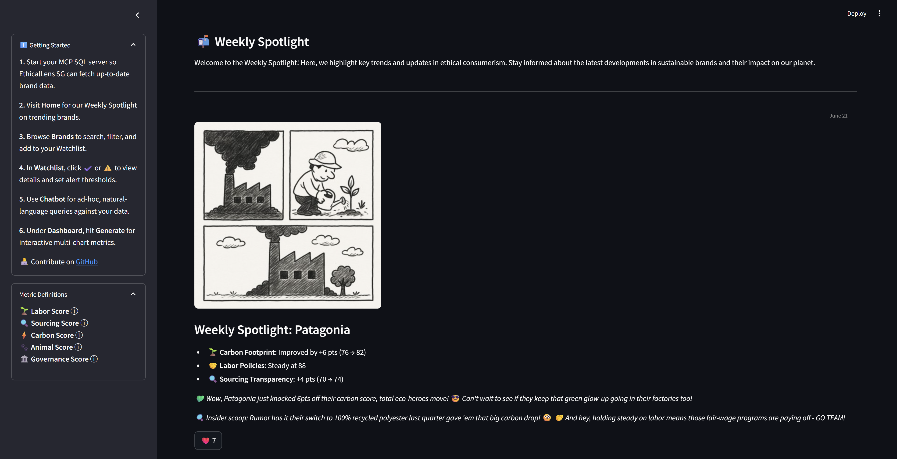

# EthicalLens SG

An AI intergrated Streamlit MCP app for **ethical brand–awareness**, combining natural-language queries, interactive dashboards, and personalized alerts across five key metrics (labor, sourcing, carbon, animal, governance).



## 🔍 Features
- **Weekly Spotlight**: Home tab with curated highlights, fun insights & reactions.  
- **Brands**: Search/filter all brands, view latest ethical scores & financials, add to Watchlist.  
- **Watchlist**: Set per-brand alert thresholds, see pending alerts, manage your list.  
- **Chatbot**: Natural-language SQL queries powered by MCP + LLM, with starter prompts.  
- **Dashboard**: Interactive charts that helps to bring about insights.
  1. Time-series grouped-bar charts for all five metrics  
  2. Correlation heatmap  
  3. Ethics vs. Revenue scatter (2024)  
  4. Sector & region breakdown  
- **MCP Integration:** Leverages the Modular Control Protocol (MCP) for secure and efficient database interaction.

## 📁 File Structure
```bash
├─ app.py # Streamlit UI & tab logic
├─ agent.py # LLM + MCP server integration
├─ brand_agent.py # MCP helper: get_brand_list / get_brand_details
├─ dashboard_agent.py # (LLM) dashboard-planning agent
├─ mcp_dashboard_agent.py # MCP helper: get_all_scores, scatter, sector/region
├─ mcp_scatter_agent.py # MCP helper: ethics × finance (2024)
├─ mcp_sector_agent.py # MCP helper: sector & region averages
├─ llm_model.py # LLM model loader
├─ test_query.sql # Example schema & seed data
├─ pyproject.toml # UV & Python dependencies
├─ README.md # This file
└─ images/ # PNGs used in Home tab
```

## ⚙️ Prerequisites

- Python 3.10+  
- UV package manager (or install via pip)  [For more info](https://astral.sh/uv)
- MCP SQL Server (run via `uvx mcp-sql-server --db-host your_host --db-database your_database --db-user your_user --db-password your_password`)  
- Environment variables in a `.env` file at project root:  
  DB_HOST=your_hostname
  DB_USER=your_db_user  
  DB_PASSWORD=your_db_password  
  DB_NAME=your_db_name  
  MODEL_API_KEY=your_LLM_API_key  
  MODEL_ID=optional_model_id (i.e., gemini-flash-2.0)
- SQL database (e.g., MySQL, PostGres) with some seeeded data (or seed the MySQL database via `test_query.sql`).

## Setup and Installation (using UV)

1.  **Change directory:**

    ```bash
    cd mcp-agent-experiment
    ```

2.  **Install Dependencies with UV:**

    ```bash
    uv sync
    ```
    This command will:
    * Create a virtual environment if one does not exist.
    * Install all the dependencies listed in the `pyproject.toml` file.

3.  **Create `.env` File:**

    Create a `.env` file in the project root and add your environment variables:

    ```
    
    DB_HOST=your_db_host
    DB_USER=your_db_user
    DB_PASSWORD=your_db_password
    DB_NAME=your_db_name
    MODEL_API_KEY = API for OpenAI or GROQ
    MODEL_ID = The ID of the language model to use like gemini-2.0-flash, llama-3.3-70b-versatile, gpt-4o
    ```
    *Note :- Gives better results with OpenAI models


## Running the Application

1.  **Activate the Virtual Environment:**
    UV will create a `.venv` folder in your project.
    ```bash
    source .venv/Scripts/activate  # On Linux/macOS
    .venv\Scripts\activate  # On Windows
    ```

2. **Run the MCP server**
   Run this command to connect to the MCP server
   ```bash
   uvx mcp-sql-server --db-host localhost --db-database ethical_scores --db-user root --db-password your_password
   ```

   Run this command to run the proxy server to inspect the tools and other connection details
   ```bash
   npx @modelcontextprotocol/inspector uvx mcp-sql-server --db-host localhost --db-database ethical_scores --db-user root --db-password your_password
   ```

3. **Add in LLM API token in the corresponding files**
   This application is using gemini-flash-2.0.

4.  **Run the Streamlit App:**

    ```bash
    streamlit run app.py
    ```

5.  **Access the App:**

    Open your web browser and go to the URL provided in the terminal (usually `http://localhost:8501`).

## Usage

### Home  
Weekly Spotlight with Patagonia highlights and Top Movers—hover for sources, react with ❤️.

### Brands  
Filter/select brands → “Details” shows radar & time-series charts + financial metrics → “☆ Watch” adds to Watchlist.

### Watchlist  
See watched brands, set alert thresholds, click **Set Alerts** to generate notifications, clear on unwatch or threshold reset.

### Chatbot  
Click a starter prompt or type your own natural-language query; the LLM + MCP agent executes SQL and returns summaries or charts.

### Dashboard  
1. Click **Generate Dashboard** to load data.  
2. Use brand multiselect and date picker to filter.  
3. Explore five grouped-bar charts, correlation heatmap, ethics×revenue scatter, and sector & region breakdown.

## 📚 Additional Files

- **test_query.sql**: Schema & seed data for testing.  
- **images/**: Home tab graphics.

## 🤝 Contributing

- [bryan100805](https://github.com/bryan100805)
- [Kennetan2](https://github.com/Kennetan2)

## 📄 License

MIT
